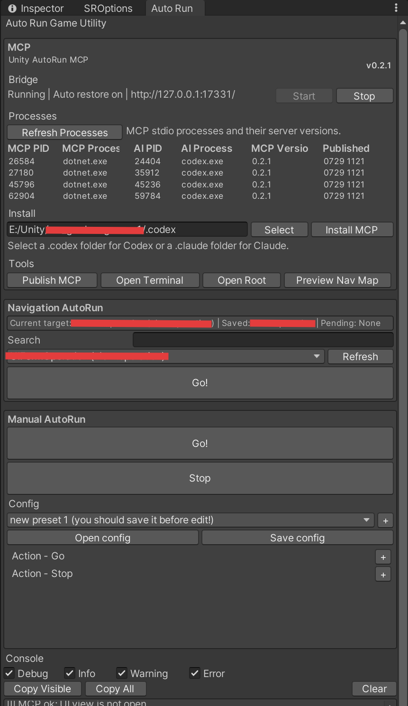

# Unity Autorun Tool

[中文（默认）](./README.md) | [English](./README_EN.md)

Unity Autorun Tool 是一个 Unity Editor 扩展，用于自动化 UI 启动流程、测试导航和 AI 辅助 UI 操作。它可以通过编辑器预设点击 UGUI 与 FairyGUI 按钮，也可以通过本地 HTTP Bridge 和 .NET 8 MCP Server 把同样的能力开放给外部工具或 AI 客户端。

## 快速使用

在 Unity 中打开 `Window > Auto Run Window`，即可看到下面的实际程序界面。

<p align="center">
  
</p>

截图上半部分是 `MCP` 区域，用于连接 AI 客户端并确认 Bridge 状态；下半部分是 `Navigation AutoRun` 区域，用于搜索、选择并运行导航图中的目标界面。

### 快速安装

推荐通过 [Unity Package Manager 的 Git URL](https://docs.unity3d.com/cn/2021.3/Manual/upm-ui-giturl.html) 安装。使用此方式前，请确认本机已安装 [Git](https://git-scm.com/downloads)。

1. 在 Unity 中打开 `Window > Package Manager`。
2. 点击左上角的 `+`，选择 `Add package from git URL...`。
3. 输入以下 Git URL，然后点击 `Add`：

```text
https://github.com/SHthemW/Unity-Autorun-Tool.git
```

4. 等待安装和脚本编译完成，再打开 `Window > Auto Run Window`。

如需固定版本或手动安装，请参阅[完整安装说明](#安装)。

### 首次接入 AI

1. 确认本机已安装 [.NET 8 SDK](https://dotnet.microsoft.com/zh-cn/download/dotnet/8.0)，并打开 `Window > Auto Run Window`。
2. 在截图上方的 `MCP` 区域点击 `Publish MCP`，生成当前版本的 MCP Server。
3. 点击 `Select`，选择项目的 `.codex` 文件夹或 Claude Code 项目的 `.claude` 文件夹，再依次点击 `Install MCP` 和 `Install Skill`。
4. 重新连接对应的 AI 客户端。`Bridge` 显示 `Running`，并且 `Processes` 中出现对应客户端进程时，表示连接已经建立。
5. 首次使用时，让 AI 生成完整导航图：

```text
$unity-autorun gen-nav
```

AI 会通过 MCP 扫描源码、审核导航候选并生成 `ProjectSettings/Packages/com.shthemw.unity-autorun-tool/ui-nav-map.json`。只有最终化检查通过的导航图才会用于自动运行。

Claude Desktop 只支持通过此面板安装 MCP：选择包含 `claude_desktop_config.json` 的配置目录并点击 `Install MCP`。本地文件系统 Skill 属于 Claude Code 能力，因此 Desktop 目标不会启用 `Install Skill`。

### 安装 Unity Autorun Skill

仓库在 [`skill~/unity-autorun/`](./skill~/unity-autorun/) 提供可安装的 Skill 源码。该 Skill 仅在用户显式调用 `$unity-autorun` 时启用，不会因普通 Unity UI 请求自动介入。进入默认运行时模式后，AI 会先快速判断任务及相关 UI 是否兼容 Autorun；兼容时主动使用导航、UIState 和异步断言完成自测与结构化表现审核，不兼容时简要说明具体原因。`gen-nav` 参数用于生成或更新导航图，并通过 `get_nav_map_guidance` 读取与当前 MCP 版本匹配的精简动态契约。

1. 确保 `unity-autorun` MCP Server 已安装并连接。
2. 推荐在 `Window > Auto Run Window` 的 `MCP > Install` 中选择 `.codex` 或 Claude Code 项目的 `.claude` 目录，再点击 `Install Skill`。Codex 目标会安装到所选 `.codex` 同级的 `.agents/skills/unity-autorun`，Claude Code 目标会安装到 `.claude/skills/unity-autorun`。
3. 也可以在 Codex 对话中使用 `$skill-installer` 从 GitHub 文件夹安装当前开发分支：

   ```text
   $skill-installer install https://github.com/SHthemW/Unity-Autorun-MCP/tree/dev_UIState/skill~/unity-autorun
   ```

4. Codex 通常会自动发现新 Skill；如果未出现，请重新启动 Codex。
5. 通过 `$unity-autorun` 显式调用；未显式调用时，Skill 不会介入常规 Unity 工作流。

运行时导航、自测和表现审核示例：

```text
$unity-autorun 运行游戏并打开背包界面，验证金币文本非空、关闭按钮可交互
```

生成完整导航图或只更新指定范围：

```text
$unity-autorun gen-nav
$unity-autorun gen-nav 更新商店模块
```

如需手动安装，Codex 请将整个 `unity-autorun` 文件夹复制到个人目录 `$HOME/.agents/skills/` 或项目目录 `$REPO_ROOT/.agents/skills/`；Claude Code 请复制到 `$HOME/.claude/skills/` 或 `$REPO_ROOT/.claude/skills/`。

Skill 依赖已经安装并连接的 `unity-autorun` MCP Server，不会代替 MCP 安装。

### 让 AI 自动运行到目标界面

导航图准备完成后，直接告诉 AI 目标即可，例如：

```text
运行游戏并打开背包界面。
```

AI 会发起一次异步导航任务，并持续查询任务状态，直到 Unity 启动游戏、通过中间界面并到达目标。通常不需要手动点击 Unity 的 Play 按钮，也不需要让 AI 反复读取完整导航图。

如果希望直接从编辑器操作，也可以在截图下方的 `Navigation AutoRun` 区域中输入关键词、选择目标，然后点击 `Go!`。Unity 不在 Play Mode 时，工具会自动进入 Play Mode，并在启动后继续执行导航。

## 功能特性

- 支持 AI 客户端直接启动 Unity 并导航到指定 UI 界面。
- 通过项目级 `ProjectSettings/Packages/com.shthemw.unity-autorun-tool/ui-nav-map.json` 支持 UI 导航图。
- 支持对 click / wait 类型 UI 路由进行解析和执行。
- 支持跨 Play Mode 恢复的异步 UI 导航任务与紧凑状态轮询。
- 导航图工具覆盖 guidance、源码扫描、patch 校验、merge、summary、subgraph 和 HTML 预览。
- .NET 8 CLI 与 MCP Server，可供 Codex、Claude 或其他 MCP 客户端调用。
- 提供可从编辑器一键安装或通过 `$skill-installer` 下载的 Unity Autorun Skill，仅在显式调用后负责兼容性判断、导航和 UIState 自测，并通过 `gen-nav` 参数生成或更新导航图。
- 本地 HTTP Bridge，默认监听 `127.0.0.1:17331`。
- 支持按 GameObject 名称或按钮文本发现并点击 UGUI 按钮。
- 支持读取和断言运行时 UGUI、TextMeshPro 控件的当前值。
- 项目安装 FairyGUI 时，可选支持 FairyGUI 按钮自动点击。
- 支持带延迟的动作序列，可用于 Play Mode 启动和退出前流程。
- Auto Run Window 内置 Console，支持 Debug、Info、Warning、Error 过滤。
- 保留 Manual AutoRun 面板，用于维护不依赖 AI 的 Go / Stop 动作预设。

## 环境要求

- [Unity 2021.3 或更新版本](https://unity.com/download)。
- 内置 UGUI 按钮自动化依赖 Unity UGUI。
- 只有需要自动化 FairyGUI 按钮时才需要安装 [FairyGUI](https://www.fairygui.com/download)。
- CLI 和 MCP Server 需要 [.NET 8 SDK](https://dotnet.microsoft.com/zh-cn/download/dotnet/8.0)。

## 安装

推荐使用 [Unity Package Manager 的 Git URL](https://docs.unity3d.com/cn/2021.3/Manual/upm-ui-giturl.html) 安装。此方式需要本机已安装 [Git](https://git-scm.com/downloads)。

1. 打开 `Window > Package Manager`。
2. 点击 `+`。
3. 选择 `Add package from git URL...`。
4. 输入：

```text
https://github.com/SHthemW/Unity-Autorun-Tool.git
```

为了保证安装版本可复现，建议使用版本 tag：

```text
https://github.com/SHthemW/Unity-Autorun-Tool.git#v0.2.5
```

也可以手动安装。将本仓库复制或克隆到 Unity 项目的：

```text
Assets/Editor/Unity-Autorun-Tool
```

在 Unity 中打开：

```text
Window > Auto Run Window
```

## MCP 与 Bridge 面板

`Window > Auto Run Window` 中的 `MCP` 面板包含 Bridge 控制、MCP 进程检测、安装入口和辅助工具。

- `Versions` 区域同时显示 MCP 源码版本、已发布二进制版本、Bundled Skill 版本和所选客户端中的 Installed Skill 版本。
- 工具启动后每 24 小时从发布仓库的 `package.json` 检查一次新版本；失败时 1 小时后重试，也可以点击 `Check Now` 立即检查。
- `Processes` 表格会显示每个 AI 客户端当前加载的 MCP 服务端二进制版本。
- `Start` / `Stop` 控制本地 Unity Bridge。
- `Publish MCP` 会先终止指向当前发布 DLL 的 MCP 子进程，等待文件解锁后执行 `dotnet publish`，并检测 AI 客户端是否自动重连。
- `Install MCP` 会更新选中的 `.codex/config.toml`；选择 Claude Code 项目的 `.claude` 时，会更新其同级项目根目录 `.mcp.json`；选择包含 `claude_desktop_config.json` 的 Claude Desktop 配置目录时，会保留其他服务并合并 `unity-autorun`。旧版本误写到 `.claude/.mcp.json` 的文件会保持不变并显示迁移提示，但 Claude Code 不会再从该位置读取项目 MCP。
- `Install Skill` 会将包内 Skill 复制到 Codex 或 Claude Code 的 Skill 目录，并根据已安装版本自动显示 Install、Update、Reinstall 或 Repair 状态。Claude Desktop 不读取 Claude Code 的文件系统 Skill，因此选择 Desktop 配置目录时该按钮会禁用。
- `Open Root` 打开当前工具目录。
- `Preview Nav Map` 使用内置的 Viz.js / Graphviz 自动布局，将项目导航图渲染为可交互的 `Library/UnityAutorunTool/ui-nav-map.preview.html`。

也可以通过独立菜单启动或停止 Bridge：

```text
Window > Auto Run MCP Bridge > Start
Window > Auto Run MCP Bridge > Stop
```

Bridge 默认监听：

```text
http://127.0.0.1:17331/
```

如果端口 `17331` 已被占用，Bridge 会自动逐个尝试后续端口，直到找到可用端口。Auto Run 窗口会显示实际使用的 URL。

选中的端点会发布到当前 Unity 项目的 `Library` 目录。MCP 配置不再保存端口，AI 客户端通过 `get_unity_bridge_port` 动态取得端点。

## CLI

请从工具根目录运行 CLI。可以在 Unity 中打开 `Window > Auto Run Window`，点击 `MCP` 面板里的 `Open Root`，然后在打开的目录中启动终端。这种方式同时适用于 UPM Git URL 安装和手动 `Assets/Editor` 安装。

```powershell
dotnet run --project mcp~/UnityAutorun.Mcp -- help
dotnet run --project mcp~/UnityAutorun.Mcp -- bridge-port
dotnet run --project mcp~/UnityAutorun.Mcp -- status
dotnet run --project mcp~/UnityAutorun.Mcp -- play
dotnet run --project mcp~/UnityAutorun.Mcp -- stop
dotnet run --project mcp~/UnityAutorun.Mcp -- list-buttons --framework all
dotnet run --project mcp~/UnityAutorun.Mcp -- ui-state --query MusicToggle --type Toggle
dotnet run --project mcp~/UnityAutorun.Mcp -- wait-ui-state --query MusicToggle --property isOn --comparison equals --expected true
dotnet run --project mcp~/UnityAutorun.Mcp -- click --name StartButton --framework ugui
dotnet run --project mcp~/UnityAutorun.Mcp -- run-sequence --json-file sequence.json
dotnet run --project mcp~/UnityAutorun.Mcp -- nav-guidance
dotnet run --project mcp~/UnityAutorun.Mcp -- scan-nav-sources
dotnet run --project mcp~/UnityAutorun.Mcp -- trace-nav-calls
dotnet run --project mcp~/UnityAutorun.Mcp -- backfill-nav-map --preview true
dotnet run --project mcp~/UnityAutorun.Mcp -- nav-map-summary
dotnet run --project mcp~/UnityAutorun.Mcp -- nav-candidate-coverage
dotnet run --project mcp~/UnityAutorun.Mcp -- finalize-nav-map
dotnet run --project mcp~/UnityAutorun.Mcp -- routes
dotnet run --project mcp~/UnityAutorun.Mcp -- route --from A --to C
dotnet run --project mcp~/UnityAutorun.Mcp -- run-route --from A --to C
dotnet run --project mcp~/UnityAutorun.Mcp -- navigate-ui --to TargetView
dotnet run --project mcp~/UnityAutorun.Mcp -- mock-bridge
```

环境变量：

| 变量 | 默认值 | 含义 |
| --- | --- | --- |
| `UNITY_AUTORUN_PROJECT_ROOT` | 安装时自动检测 | 使用其动态 Bridge 端点的 Unity 项目根目录。 |
| `UNITY_AUTORUN_TOOL_ROOT` | 安装时自动检测 | MCP 导航图操作使用的工具根目录。 |

## MCP Server

发布 MCP Server：

```powershell
dotnet publish mcp~/UnityAutorun.Mcp -c Release
```

Release publish 输出也会被压缩归档到：

```text
mcp~/UnityAutorun.Mcp/bin/Release-Archives/
```

### MCP 使用中发布

编辑器内的 `Publish MCP` 会按完整二进制路径精确匹配当前工具的 MCP 子进程，只终止这些进程，不会结束其它 `dotnet.exe`。进程退出且发布 DLL 解锁后，工具才会开始发布。

如果发布前存在运行中的 MCP，发布完成后工具会等待最多 5 秒，检测原有数量的 MCP 进程是否由 Codex、Claude 等客户端自动重新启动。全部恢复时会记录新的 PID；部分或全部未恢复时，发布仍视为成功，但 Auto Run Console 会写入 Warning，并显示需要重新连接客户端的提示。

Unity 无法替 AI 客户端重建 stdio 连接。如果客户端没有自动重新启动 MCP，请重启或重新连接对应的客户端会话。

直接在终端运行 `dotnet publish` 不会执行上述进程管理。如果发布 DLL 正在使用，请先关闭对应的 MCP 客户端连接，或改用编辑器内的 `Publish MCP`。

编辑器内 `Install MCP` 流程会为选中的客户端注册以下命令：

```powershell
dotnet mcp~/UnityAutorun.Mcp/bin/Release/net8.0/publish/UnityAutorun.Mcp.dll mcp
```

可用 MCP 工具：

- `get_unity_bridge_port`
- `unity_status`
- `unity_play`
- `unity_stop`
- `list_buttons`
- `is_ui_view_open`
- `get_ui_state`
- `wait_for_ui_state`
- `click_button`
- `run_sequence`
- `get_nav_map_guidance`
- `get_current_ui_nav_map`
- `save_ui_nav_map`
- `get_nav_map_summary`
- `scan_ui_nav_sources`
- `trace_ui_navigation_calls`
- `get_ui_nav_candidate_coverage`
- `finalize_ui_nav_map_generation`
- `backfill_ui_nav_map_from_sources`
- `query_nav_map_items`
- `get_ui_nav_subgraph`
- `validate_ui_nav_map_patch`
- `merge_ui_nav_map_patch`
- `list_ui_routes`
- `resolve_ui_route`
- `run_ui_route`
- `navigate_ui`
- `start_ui_navigation`
- `get_ui_navigation_status`
- `cancel_ui_navigation`

对于“运行游戏并打开某个界面”这类请求，优先调用一次 `start_ui_navigation`，然后通过 `get_ui_navigation_status` 长轮询到 `terminal=true`。启动、登录门禁、路线解析和逐步等待由 Unity 内部完成，不需要 AI 反复调用 `list_buttons`、读取完整导航图或检查全量日志。

Bridge 工具会自动读取当前项目动态发布的端点。`get_unity_bridge_port` 仅用于诊断，不再是其它 Bridge 工具的前置调用。`get_current_ui_nav_map` 默认返回摘要；只有明确需要完整文件时才传入 `full=true`。

生成导航图时，`scan_ui_nav_sources` 负责报告源码覆盖率，`trace_ui_navigation_calls` 负责返回跨辅助方法和组件类型的有界按钮调用链证据。每个候选会附带紧凑的 `decisionHint`、已映射端点 id，以及在能按宿主类型定位 Prefab 时解析到的序列化控件证据。调用链候选不会直接成为可执行边：外部 AI 必须判断来源界面、被引用界面的角色、跳转类型、控件信息、自动化方式和置信度，再验证并合并增量补丁。可达拓扑与 AutoRun 可执行性必须分开判断；缺少精确点击信息、存在异步处理或分支前提、尚未进行运行时确认，都不能抹掉源码已经证明的可达边。`backfill_ui_nav_map_from_sources` 只补充可确定的源码视图和待分析证据，不会推断控件、跳转或路线。

已有导航图只能通过 `validate_ui_nav_map_patch` 和 `merge_ui_nav_map_patch` 增量更新；`save_ui_nav_map` 仅用于首次创建，存在正式地图时会拒绝整图覆盖。补丁采用 RFC 7396 合并语义，未提供的旧字段会保留，显式 `null` 才会删除字段。候选身份不再依赖源码行号，等价补丁和已完成地图的重复最终化会返回 `writePerformed=false`，不会改写文件、版本或时间戳。

完整生成必须将不带 `query` 的 `get_ui_nav_candidate_coverage` 作为候选待办列表。外部 AI 对每个返回项复制精确的 `id` 和 `candidateVersion`，再写入一个 `candidateDecisions` 决策；合并后继续以 `offset=0` 获取下一批未审候选，直到 `remaining=0`。源码或序列化控件证据变化会使旧决策版本失效并重新进入待办列表。遇到 `semantic-review-required` 时，外部 AI 必须修正端点不匹配或没有使用已解析序列化控件身份的跳转，或者为被降级的强拓扑候选提供具体 `nonTransitionEvidence`。最后必须调用 `finalize_ui_nav_map_generation`；只要仍有未审或语义不自洽的候选，该工具就会返回 `candidate_review_incomplete` 或 `candidate_semantic_review_incomplete`，并且不会把地图标记为完成。

## HTTP Bridge

先启动 Bridge，再使用 `get_unity_bridge_port` 返回或 Auto Run 窗口显示的 URL：

```powershell
$bridgeUrl = "<动态发布的 Bridge URL>"
Invoke-RestMethod "${bridgeUrl}status"
Invoke-RestMethod "${bridgeUrl}rpc" `
  -Method Post `
  -ContentType application/json `
  -Body '{"id":"1","command":"click_button","payload":{"name":"StartButton","framework":"ugui"}}'
```

Bridge 命令包括：

- `status`
- `play`
- `stop`
- `list_buttons`
- `list_open_views`
- `is_ui_view_open`
- `get_ui_state`
- `wait_for_ui_state`
- `click_button`
- `run_sequence`
- `navigate_route`
- `cancel_navigation`
- `start_ui_navigation`
- `get_ui_navigation_status`
- `cancel_ui_navigation`

### 运行时 UI 状态

`get_ui_state` 读取当前运行时 UI，并返回框架、组件类型、GameObject 名称、完整层级路径、活动状态、可见性、交互状态和类型化属性。默认只读取活动层级，最多返回 100 个元素；使用 `query`、`scope`、`types` 和 `limit` 缩小结果范围。

当前支持以下组件：

- UGUI：`Text`、`InputField`、`Toggle`、`Slider`、`Dropdown`、`Scrollbar`、`ScrollRect`、`Button`、`Image`、`RawImage`。
- TextMeshPro：`TMP_Text`、`TMP_InputField`、`TMP_Dropdown`；项目未安装 TextMeshPro 时会自动跳过。

属性统一使用 `{name, valueType, value}` 表示，组件的 `primaryProperty` 指明 `property=value` 对应的默认属性。过长字符串会被截断并通过 `truncated` 与 `originalLength` 标记，但断言仍使用完整值。密码和 PIN 输入框默认将 `text` 返回为 `[REDACTED]`，被遮罩的文本不会参与值断言；只有显式传入 `includeSensitive=true` 时才返回并断言原文，也可以改用 `hasValue` 判断是否已填写。

`wait_for_ui_state` 用于异步 UI 自测。它会在 Unity 主线程按 `pollMs` 间隔读取筛选后的控件，直到属性满足条件或超时。`query` 必填，`property` 默认为 `value`，也可以断言 `active`、`enabled`、`visible`、`selectable`、`interactable` 元数据，并支持存在性、字符串和数值比较；断言失败返回 `ui_state_wait_timeout`，并附带最后一次观察到的值。

```json
{
  "id": "ui-test-1",
  "command": "wait_for_ui_state",
  "payload": {
    "query": "MusicToggle",
    "types": ["Toggle"],
    "property": "isOn",
    "comparison": "equals",
    "expected": "true",
    "timeoutMilliseconds": 10000
  }
}
```

## UI 导航图

导航系统使用项目级 `ProjectSettings/Packages/com.shthemw.unity-autorun-tool/ui-nav-map.json`。如果该文件不存在，编辑器会回退读取包内的 `Example/ui-nav-map.example.json`。可以通过 `UNITY_AUTORUN_NAV_MAP` 指定其他绝对路径或项目相对路径。

导航图描述：

- `views`：UI 界面、面板或视图根节点。
- `controls`：按钮和相关 UI 控件。
- `transitions`：从一个视图到另一个视图的方式。
- `routes`：跨 transition 的可复用路径。
- `unresolved`：仍需人工分析的缺口。
- `candidateDecisions`：每个静态调用链候选的紧凑审核结果，仅用于生成完整性检查，不参与运行时导航。

导航图包含 `schemaVersion`、独立于 MCP 包版本的 `generatorVersion`，以及只在语义内容实际变化时递增的 `mapVersion`。有效增量写入会把候选覆盖状态置为 `review-required`，最终化成功后才恢复为 `generation.status=complete`；语义无变化的补丁和重复最终化不会写盘。编辑器和 MCP 路由加载器会拒绝格式版本、生成器版本或完成状态不匹配的旧地图，从而避免继续使用未重新生成的文件。

`Preview Nav Map` 会用 Graphviz `dot` 自动排列存在有效 transition 的视图，并将同一对视图之间的重复 transition 聚合为一条边。没有有效 transition 的视图保留在右侧列表中，不再拉宽主图。预览支持按名称、id 或 Prefab 路径搜索，点击节点聚焦相邻路线，悬停查看边标签，以及拖动画布、滚轮缩放和一键适配。所有渲染依赖都随工具离线提供，生成后的 HTML 不访问外部 CDN。

编辑器 `Navigation AutoRun` 面板会加载导航图，列出可导航目标视图，支持搜索过滤，并通过 `Go!` 执行路由。如果 Unity 尚未处于 Play Mode，工具会保存待执行目标，进入 Play Mode，然后在 Play Mode 启动后继续执行。

路由执行支持：

- 由 UGUI 或 FairyGUI 按钮动作驱动的 `click` step。
- UGUI 导航点击会通过当前 `EventSystem` 验证：按钮必须可交互，并且是指针射线最上层命中对象，随后才依次派发 pointer-down、pointer-up 和 pointer-click。
- 等待目标 view 处于活动、前台且状态稳定的 `wait` step。
- 把控件的 `delay` 作为点击后的稳定等待时间，再执行下一步。
- 通过编辑器面板或 Bridge 命令取消执行。

导航不会调用非活动层级中的 UGUI 控件。目标 GameObject 即使已经存在，只要仍被其他 UI 遮挡，就不会被判定为到达；超时时会报告阻挡它的指针命中对象。

`start_ui_navigation` 会立即返回一个 `navigationId`，并把待执行目标保存在编辑器会话中，因此进入 Play Mode 或脚本域重载后仍可继续。`get_ui_navigation_status` 返回 `navigationStatus`、`navigationPhase`、`terminal`、`elapsedMilliseconds` 和紧凑的目标视图匹配结果。

如果使用 AI 生成导航图，Skill 会先调用 `get_nav_map_guidance` 读取精简动态契约，再使用 scan、coverage、query、validate、merge 和 finalize 工具增量更新。稳定工作流由 Skill 直接提供，MCP 不再返回完整提示词。不要直接用文件系统写入 `ui-nav-map.json`，也不要在最终化门禁通过前宣告生成完成。

## Console

Auto Run Window 内置本地 Console，用于显示工具消息。日志级别包括：

- `Debug`
- `Info`
- `Warning`
- `Error`

级别开关只影响显示过滤。`Clear` 会清空当前 entries。工具消息不会同步写入 Unity Console。

## Manual AutoRun（手动预设）

当前推荐优先使用 AI 与 `Navigation AutoRun` 完成界面自动运行。`Manual AutoRun` 作为兼容功能保留，适合不接入 AI、步骤固定且只需要按顺序点击按钮的场景。

打开 `Window > Auto Run Window`，使用靠后的 `Manual AutoRun` 面板。

1. 点击 `First use? Press me to create an autorun action config :)`。
2. 初始文件创建后点击 `Save config`。
3. 点击 `Then, press me to create a new action preset` 创建预设；已有预设后，可用预设下拉框旁边的 `+` 继续添加。
4. 在 `Action - Go` 或 `Action - Stop` 下添加动作。
5. 填写动作字段。
6. 点击 `Save config`。
7. 需要启动自动化流程时，用 `Go!` 代替 Unity 原生 Play 按钮。
8. 需要退出前执行 Stop 动作时，点击 `Stop`。

动作字段说明：

| 字段 | 含义 |
| --- | --- |
| `name` | 目标按钮的 GameObject 名称。UGUI 查找会做名称归一化，会忽略 `_`、`*`、末尾的 `GameObject` 和末尾的 `Button`。 |
| `text` | UGUI 按钮名称不唯一时的文本兜底匹配。FairyGUI 一般保留默认值，除非项目内 FairyGUI Helper 支持文本筛选。 |
| `delay` | 执行当前动作前等待的秒数。 |
| `FGUI` | 使用 FairyGUI 点击逻辑而不是 UGUI 点击逻辑。项目未安装 FairyGUI 时会自动禁用。 |

`Go` 动作会在进入 Play Mode 后运行。`Stop` 动作会在退出 Play Mode 前运行。

配置保存在 Unity 编辑器进程基目录下，而不是项目目录中：

```text
AutorunToolData/config.xml
```

因此本机手动预设默认不会进入项目版本管理。工具会创建运行时 `AutoRunHandler` GameObject，并设置为 `DontDestroyOnLoad`。使用过 `Go!` 后，如果之后直接点击 Unity 原生 Play 按钮，场景里已有的 handler 仍可能继续存在，直到被移除或重置。

## 项目结构

```text
.
|-- AutoRun*.cs                  # 共享的自动化模型和运行时 handler
|-- package.json                 # Unity Package Manager Git URL 安装元数据
|-- Bridge/                      # HTTP Bridge 模型、dispatcher、sequence 和 navigation 执行
|-- Editor/                      # Unity Editor 窗口、菜单、MCP 安装、进程检测、导航 AutoRun UI
|-- Services/                    # 按钮、活动视图与 UGUI/TMP 运行时状态服务
|-- Util/                        # XML 与可选 FairyGUI helper
|-- Example/                     # 受版本控制的示例导航图
|-- mcp~/UnityAutorun.Mcp/       # .NET 8 CLI 与 MCP Server 源码
|-- skill~/unity-autorun/        # 可分发的 AI Skill 源码与工作流提示词
```

## 排障

- 如果 `Install MCP` 失败，先点击 `Publish MCP`，并确认选择的是 `.codex`、Claude Code 项目的 `.claude`，或包含 `claude_desktop_config.json` 的 Claude Desktop 配置目录。
- 如果 Skill 版本显示 `unknown`，点击 `Repair Skill` 即可补齐版本清单并重新安装完整内容。
- 如果 CLI Bridge 调用失败，先在 Unity 中启动 Bridge，再通过 `bridge-port` 或 MCP 工具 `get_unity_bridge_port` 检查当前端点。
- 如果找不到 UGUI 按钮，检查运行时 GameObject 名称、归一化后的名称，以及可选 `text` 字段。
- 如果路由无法执行，用 `route`、`resolve_ui_route` 或 `get_ui_nav_subgraph` 检查是否存在 unsupported 或 unresolved transition。
- 如果 `Navigation AutoRun` 没有目标，创建或 merge 项目级 `ProjectSettings/Packages/com.shthemw.unity-autorun-tool/ui-nav-map.json`，也可以先用包内 example map 验证流程。
